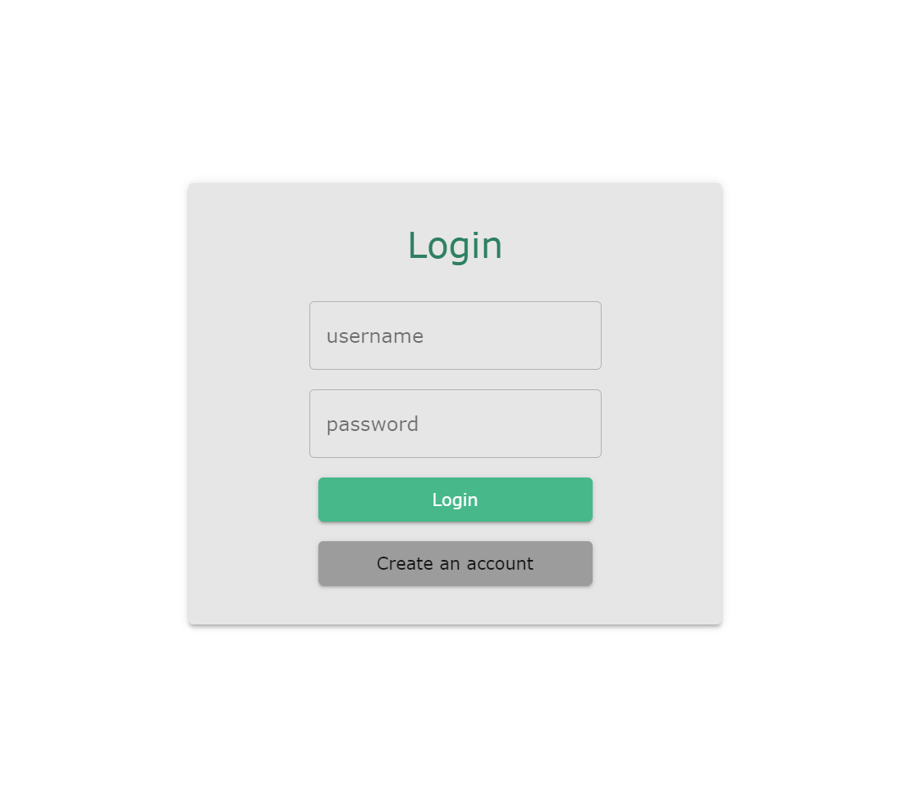
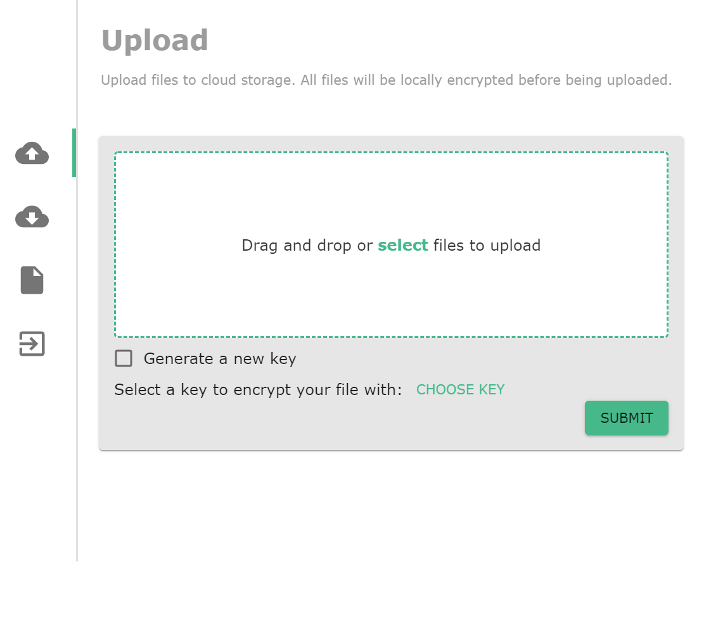
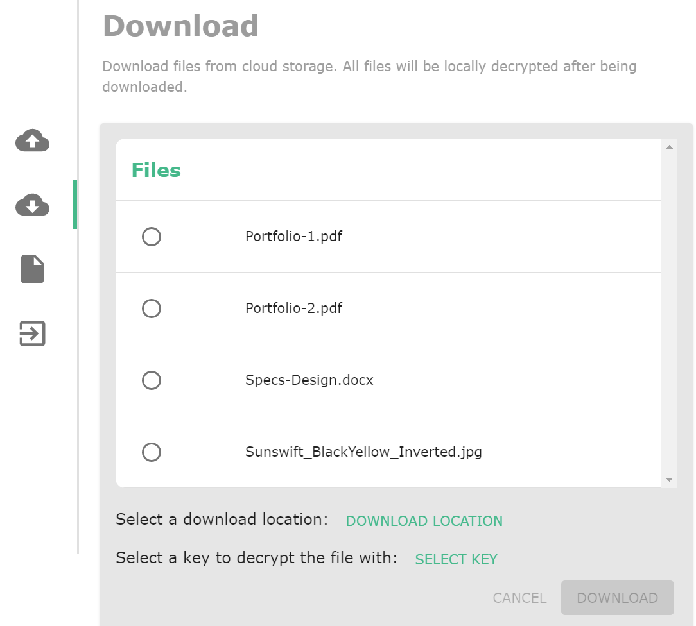
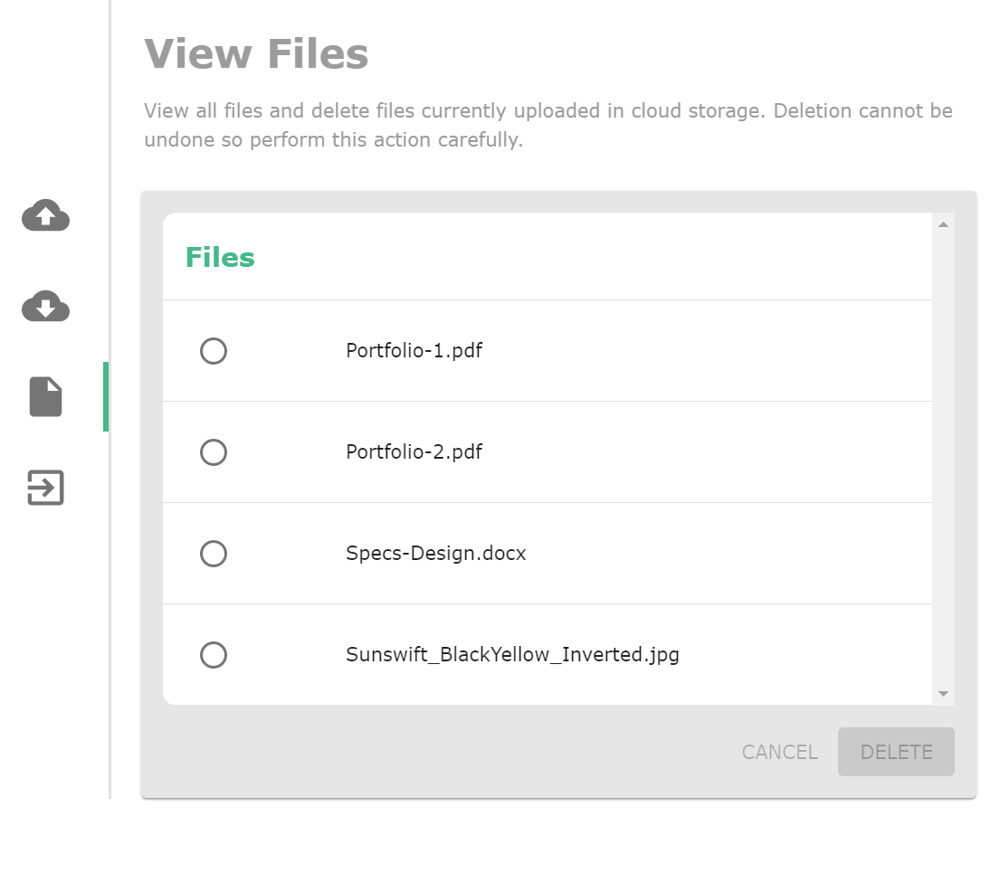
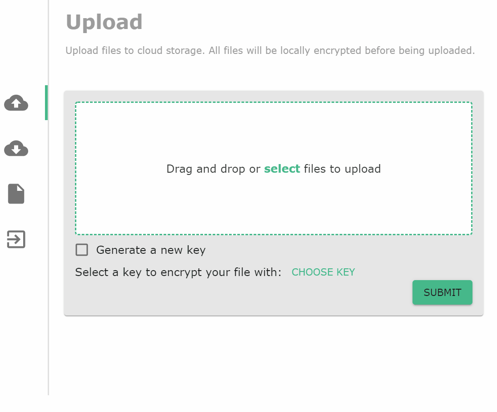

# Cloud Storage

Secure cloud storage application written for a third-year university course (COMP6841 UNSW). It allows users to securely store and retrieve their files in the AWS cloud via a local user interface.

| Version | Author | Date |
|---------|--------|------|
| v1.0.0  | Kaman Chan (salty-armadillo) | March 2021 |

---
## Current Features
* User can drag and drop file in the user interface to send it to storage
* User can download any files they have previously stored
* User can remove any files that they have previously stored
* The application will scan all files before uploading and warn the user if there is potentially sensitive data (e.g. passwords, SSH keys, certificates etc)
* All files in the cloud are encrypted
* Access to storage is restricted
* Secure file transfer is done using AWS pre-signed URLs

---
## Examples

 

 

 

 

